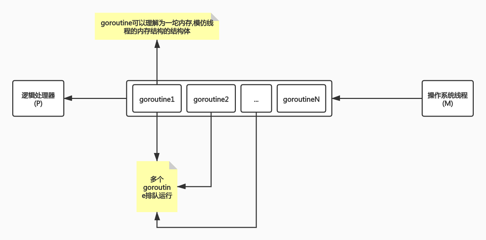

# Go 语言实践 - concurrency

## PART0. Introduction

一定要管理goroutine的生命周期,确定goroutine何时创建,何时销毁.否则就会出现goroutine的泄露.

## PART1. Goroutine

### 1.1 Processes and Threads

OS会为一个应用创建一个进程.一个应用程序就像是一个容器,这个容器为了资源而运行.这些资源包括内存地址空间、文件句柄、设备和线程.

线程是操作系统调度的一种执行路径，用于在处理器执行我们在函数中编写的代码。一个进程从一个线程开始，即主线程，当该线程终止时，进程终止。这是因为主线程是应用程序的原点。然后，主线程可以依次启动更多的线程，而这些线程可以启动更多的线程。

无论线程属于哪个进程，操作系统都会安排线程在可用处理器上运行。每个操作系统都有自己的算法来做出这些决定。

程序是从主线程开始运行的,如果主线程结束则整个程序就终止了.

### 1.2 Goroutines and Parallelism

Go 语言层面支持的 go 关键字，可以快速的让一个函数创建为 goroutine，我们可以认为 main 函数就是作为 goroutine 执行的。操作系统调度线程在可用处理器上运行，Go运行时调度 goroutines 在绑定到单个操作系统线程的逻辑处理器中运行(P)。即使使用这个单一的逻辑处理器和操作系统线程，也可以调度数十万 goroutine 以惊人的效率和性能并发运行。

Concurrency is not Parallelism.

**并发不意味着并行!**

并发不是并行。并行是指两个或多个线程同时在不同的处理器执行代码。如果将运行时配置为使用多个逻辑处理器，则调度程序将在这些逻辑处理器之间分配 goroutine，这将导致 goroutine 在不同的操作系统线程上运行。但是，要获得真正的并行性，您需要在具有多个物理处理器的计算机上运行程序。否则，goroutines 将针对单个物理处理器并发运行，即使 Go 运行时使用多个逻辑处理器。

goroutine绑定到线程上,然后挂载到逻辑处理器中执行.逻辑处理器和线程是绑定的.



并行与并发的区别:


### 1.3 Keep yourself busy or do the work yourself

```go
package main

import (
	"fmt"
	"log"
	"net/http"
)

func main() {
	http.HandleFunc("/", func(w http.ResponseWriter, r *http.Request) {
		fmt.Fprintln(w, "Hello")
	})

	go func() {
		if err := http.ListenAndServe(":8081", nil); err != nil {
			log.Fatal(err)
		}
	}()

	// 空的select语句将永远阻塞
	select {}
}
```

假设多核状态下,则匿名函数会被放到某个核心上去执行,也就是具备了**并行**的能力.goroutine是由go runtime来调度的(用户态),线程是OS负责调度的(内核态).所以goroutine更轻量级.

这段代码中,本来`ListenAndServe`应该是会阻塞的(因为本质上它是一个死循环),因此就把这段代码放到别的核心上去执行了,这样main()函数就可以执行一些以其他逻辑了.可是main()函数退出了,整个程序就退出了,这样`ListenAndServe`也就退出了.为了避免这种情况,有人就使用了一个空的select来阻塞main()函数.

不鼓励这种做法.因为如果`ListenAndServe`,按照这个写法,main()函数是无法感知到的,也无法让main()函数执行完毕进而退出,只能由这个匿名函数自己去做退出的操作(`log.Fatal()`,该函数调用了`os.Exit()`).这样的退出方式会导致defer无法执行.

2个缺点:

1. main()函数无法感知自己开启的goroutine的生命周期
2. 直接退出导致defer无法执行

即使我们去掉`go`,改为串行,使得main()函数可以感知`ListenAndServe`的报错情况,依旧无法解决上述的第2个缺点:defer无法执行.

```go
package main

import (
	"fmt"
	"log"
	"net/http"
)

func main() {
	http.HandleFunc("/", func(w http.ResponseWriter, r *http.Request) {
		fmt.Fprintln(w, "Hello")
	})

	if err := http.ListenAndServe(":8081", nil); err != nil {
		log.Fatal(err)
	}
}
```

问题:有没有办法既能安全退出又不影响main()函数执行的的方案呢?

"Keep yourself busy":如果main()函数只有一个监听的逻辑,那么让main()函数阻塞是没有问题的.也就是把"busy"的工作自己做了,而非委派出去给别的函数做.

"do the work yourself":让main()函数自己处理,比委派给其他函数并无法感知这个函数的执行情况,要好得多.

### 1.4 Never start a goroutine without knowning when it will stop

那么如果想要委派出去,该怎么办呢?

```go
package main

import (
	"fmt"
	"net/http"
	_ "net/http/pprof"
)

func main() {
	mux := http.NewServeMux()
	mux.HandleFunc("/", func(resp http.ResponseWriter, req *http.Request) {
		fmt.Fprintln(resp, "Hello")
	})

	// debug
	go http.ListenAndServe("127.0.0.1:8082", http.DefaultServeMux)
	// app traffic
	http.ListenAndServe("0.0.0.0:8081", mux)
}
```

假设此时main()函数中又要监听8081端口,又要监听8082端口.假设此时8081端口用于处理业务,8082端口用于profiling.那么2个Listen都会阻塞,就只能开一个`go func`去执行其中1个Listen.

这段代码的问题:

1. 在main()函数中开启的goroutine,main()函数无法得知何时退出,何时结束 -> 需要一种机制使main()能够感知到
2. 不应该在不知道一个goroutine合适结束的前提下,开启一个goroutine

也就是说,这种goroutine的声明周期需要被管理起来.

所以通常在启动一个goroutine时,要问自己2个问题:

1. 这个goroutine何时终止?(被动感知)
2. 如何能控制这个goroutine结束?(主动触发)

此时如果8082端口挂掉了,main()函数无法感知,当需要诊断问题时,该端口的工作情况必然是不符合预期的.通常希望二者有一个挂掉,就直接整个进程退出.

那么,如何改进呢?

```go
package main

import (
	"fmt"
	"net/http"
)

func serveApp() {
	mux := http.NewServeMux()
	mux.HandleFunc("/", func(resp http.ResponseWriter, req *http.Request) {
		fmt.Fprintln(resp, "Hello")
	})
	http.ListenAndServe("127.0.0.1:8081", mux)
}

func serveDebug() {
	http.ListenAndServe("127.0.0.1:8082", http.DefaultServeMux)
}

func main() {
	go serveDebug()
	serveApp()
}
```

首先将这2个操作单独抽离出来.然后在main()函数中调用.那么如果`serveApp()`返回了,则main.main将返回,进而导致程序关闭.那么这种情况只能靠supervisor等进程管理工具重新将这个程序启动起来.如果`serveDebug()`出错,则main()仍旧感知不到.所以还需要继续改进

```go
package main

import (
	"fmt"
	"log"
	"net/http"
)

func serveApp() {
	mux := http.NewServeMux()
	mux.HandleFunc("/", func(resp http.ResponseWriter, req *http.Request) {
		fmt.Fprintln(resp, "Hello")
	})
	if err := http.ListenAndServe("127.0.0.1:8081", mux); err != nil {
		log.Fatal(err)
	}
}

func serveDebug() {
	if err := http.ListenAndServe("127.0.0.1:8082", http.DefaultServeMux); err != nil {
		log.Fatal(err)
	}
}

func main() {
	go serveApp()
	go serveDebug()
	select {}
}
```

利用`log.Fatal()`内部调用`os.Exit()`的方式,来实现任何一个监听出错,则整个进程退出的功能.但还是没能解决上文中说到的另一个问题:defer不执行的问题没有解决.

**`log.Fatal()`只能在`main.main`中或`init`函数中使用!**

再举一个不好的启动监听写法:

```go
package main

import (
	"fmt"
	"log"
	"net/http"
)

func serveApp() {
	go func() {
		mux := http.NewServeMux()
		mux.HandleFunc("/", func(resp http.ResponseWriter, req *http.Request) {
			fmt.Fprintln(resp, "Hello")
		})
		if err := http.ListenAndServe("127.0.0.1:8081", mux); err != nil {
			log.Fatal(err)
		}
	}()
}

func serveDebug() {
	go func() {
		if err := http.ListenAndServe("127.0.0.1:8082", http.DefaultServeMux); err != nil {
			log.Fatal(err)
		}
	}()
}

func main() {
	serveApp()
	serveDebug()
	select {}
}
```

这样写的问题在于:如果不去读`serveApp()`和`serveDebug()`的代码,是不可能知道后台启了goroutine来做监听的!

回看1.1,"Keep yourself busy","busy work"应该是自己做的.也就是说"阻塞"的任务应该交给`serveApp()`,而开启goroutine应该是由main()函数去做的.

**启goroutine的一定是调用者!一定是调用者来决定是否将某个操作后台异步执行**

**对于函数的提供者而言,提供者不该假设行为.所谓的"假设行为",即不该自己内部起一个goroutine然后帮助函数的调用者将work消化掉,这样做就是"假设我的调用者要求我在后台执行某操作"**

继续改进.不要因为走了太远而忘记为何出发.记住我们的目的是:让main()函数能够感知goroutine的报错情况并能根据报错情况控制main()函数所开启的goroutine的生命周期.

```go
package main

import (
	"context"
	"fmt"
	"net/http"
)

func main() {
	done := make(chan error, 2)
	stop := make(chan struct{})

	go func() {
		done <- serveDebug(stop)
	}()

	go func() {
		done <- serveApp(stop)
	}()

	var stopped bool
	for i := 0; i < cap(done); i++ {
		if err := <- done; err != nil {
			fmt.Printf("error: %v", err)
		}

		if !stopped {
			stopped = true
			close(stop)
		}
	}
}

func serve(addr string, handler http.Handler, stop <-chan struct{}) error {
	s := http.Server{
		Addr: addr,
		Handler: handler,
	}

	go func() {
		<- stop
		// TODO: 此处的error应该wrap
		s.Shutdown(context.Background())
	}()

	return s.ListenAndServe()
}

func serveApp(stop <-chan struct{}) error {
	addr := "127.0.0.1:8081"
	handler := func(resp http.ResponseWriter, req *http.Request) {
		fmt.Fprintln(resp, "Hello")
	}

	return serve(addr, http.HandlerFunc(handler), stop)
}

func serveDebug(stop <-chan struct{}) error {
	addr := "127.0.0.1:8082"
	handler := http.DefaultServeMux

	return serve(addr, handler, stop)
}
```

注:空struct表示zero size.即0大小

首先,还是让调用者(也就是main()函数)来决定是否启动goroutine.管道stop用来广播信号.管道done用来存储2个goroutine的error.

控制生命周期:当main()函数感知到这2个goroutine中的任何一个有错误(也就是`err := <- done`不再阻塞)时,for循环将可以继续.由于bool类型的默认值为false,所以第1次循环(`cap(done)`为2,所以这个循环是可以循环2次的)时管道就会被关闭.管道关闭时会广播所有阻塞的goroutine,这样`serve()`函数在自己开启的goroutine内将不再阻塞,进而能够调用到`http.Server.Shutdown()`,实现平滑关闭.同时也达到了由main()函数来控制goroutine生命周期的目标.

感知错误:当`serveApp()`或`serveDebug()`二者任何一个报错时,将会向管道done中存入一个error,因此main()函数中能够从该管道中取出元素时,也就意味着main()函数感知到错误了.这样也就实现了感知报错情况的目标.

for循环2次的目的:实际上循环1次时stop就已经被关闭了.但是由于2个goroutine分别都要关闭,假设`serveApp()`是由于报错而关闭的,那么`serveDebug()`也要受该原因影响而关闭,因此`serveDebug()`的阻塞也要被取消,进而调用到`http.Server.Shutdown()`.则`serveDebug()`的`http.Server.ListenAndServer()`才能够退出.这样就实现了二者均平滑退出的目的.当然此时可能`serveDedebug()`返回的是nil.

// TODO: stop的类型是 `chan struct{}`,但`serve`的形参列表要求的是`<-chan struct{}`,为什么二者可以类型相同?

1. 对于一个函数而言,应该让其调用者来决定,该函数需要在前台执行还是后台执行
2. 调用者一定要能够感知并控制自己开启的goroutine的生命周期

再来看一个例子:

```go
// leak is a buggy function.It launches a goroutine that
// blocks receiving from a channel. Nothing will ever be sent
// on that channel and the channel is never closed so that goroutine
// will be blocked forever.
// leak 是一个有bug的函数.leak启动了一个goroutine,该goroutine会因为从管道中接收数据而阻塞.
// 不会有任何数据被发送至这个管道,而且这个管道不会被关闭.因此该goroutine将会一直被阻塞.
func leak() {
	ch := make(chan int)

	go func() {
		val := <- ch
		fmt.Println("We received a value, ", val)
	}()
}
```

leak()中的goroutine是会泄露的.因为永远不会有信号传递到`ch`中的,所以在`leak()`执行完毕后,这个goroutine一定会泄露的.因此不要写这种代码.

再来看一个例子:

```go
package main

import (
	"fmt"
	"log"
	"time"
)

func main() {
	err := process("abc")
	if err != nil {
		log.Print("err:", err)
	}
}

// search simulates a function that finds a record based
// on a search term. It takes 200ms to perform this work
// search 函数模仿了一个基于关键字查找记录的操作.此处用延迟200ms来表示这个操作.
func search(term string) (string, error) {
	time.Sleep(200 * time.Millisecond)
	return "some value", nil
}

// process is the work for the program. It finds a record
// then prints it
// process 是这段程序的运行者.该函数寻找一条记录并打印该记录.
func process(term string) error {
	record, err := search(term)
	if err != nil {
		return err
	}

	fmt.Println("Received:", record)
	return nil
}
```

这段代码的问题在于:对于`process()`函数而言,无法得知`search()`函数何时返回.所以需要做超时控制.

改进:使用context做超时控制

```go
package main

import (
	"context"
	"errors"
	"fmt"
	"log"
	"time"
)

func main() {
	err := process("abc")
	if err != nil {
		log.Println("err:", err)
	}
}

// result wraps the return values from search. It allows us
// to pass both values across a single channel.
// result 封装了 search 的返回值.该结构体可以让我们把返回值通过一个管道进行传递
type result struct {
	record string
	err error
}

// search simulates a function that finds a record based
// on a search term. It takes 200ms to perform this work
// search 函数模仿了一个基于关键字查找记录的操作.此处用延迟200ms来表示这个操作.
func search(term string) (string, error) {
	time.Sleep(200 * time.Millisecond)
	return "some value", nil
}

// process is the work for the program. It finds a record
// then prints it. It fails if it takes more than 100ms.
// process 是这段程序的运行者.该函数寻找一条记录并打印该记录.
// 该函数在运行超过100ms的情况下会失败.
func process(term string) error {
	// Create a context that will be canceled in 100ms
	// 创建1个context,该context在100ms后被取消
	ctx, cancel := context.WithTimeout(context.Background(), 100 * time.Millisecond)
	defer cancel()

	// Make a channel for the goroutine to report its result
	// 为goroutine创建一个管道,该管道用于报告goroutine的工作结果
	ch := make(chan result)

	// Launch a goroutine to find the record. Create a result
	// from the returned values to send through the channel.
	// 开启一个goroutine用于寻找记录.根据该goroutine的返回值创建一个 result 的实例,
	// 然后发送将该实例发送至管道
	go func() {
		record, err := search(term)
		ch <- result{record, err}
	}()

	// Block waiting to either receive from the goroutine's
	// channel or for the context to be canceled.
	// 因为等待从goroutine的channel中接收结果或因为context被取消而阻塞
	select {
	case <- ctx.Done():
		return errors.New("search canceled")
	case result := <- ch:
		if result.err != nil {
			return result.err
		}
		fmt.Println("Received:", result.record)
		return nil
	}
}
```

1. 后台执行交给调用者
2. 要有一种机制知道自己创建的goroutine何时退出
3. 要做超时控制


### 1.5 Leave concurrency to the caller

Question1: 以下2个API有何区别?

```go
// ListDirectoryA returns the contents of dir.
// ListDirectoryA 返回dir下的内容
func ListDirectoryA(dir string) ([]string, error) {
	directories := make([]string, 10, 10)
	return directories, nil
}

// ListDirectoryB returns a channel over which directory entries
// will be published. When the list of entries is exhausted,
// the channel will be closed.
// ListDirectoryB 返回一个管道,dir下的目录项将会被推送至这个管道中.
// 当dir下的目录项全部被推送至管道时,管道将会被关闭
func ListDirectoryB(dir string) chan string {
	directories := make(chan string, 10)
	go func() {
		for {
			directories <- "mock dir"
		}
	}()
	return directories
}
```

对于`ListDirectoryA()`来讲,若dir下的目录树非常庞大,需要枚举非常久,就需要等待很长时间.因此就会想到:是不是可以让其返回一个channel,对于调用者而言就可以不断地从该channel中读取目录.

那么实际上`ListDirectoryB()`是存在2个问题的:

1. 必须通过关闭channel的方式,才能告知调用者:目录树读取完毕.如果读取目录树的过程中报错了,其调用者是无法得知这个channel到底是读取目录树中途报错而被关闭,还是目录树读取完毕而被关闭.(这个或许用结构体包一下,加一个error还是可解的)
2. 调用者必须持续的从这个管道中读取,直到这个管道被关闭.假设调用者只需要目录树中的某一个值出现,之后就不再需要从该管道中读取了.此时对于该函数的调用者而言,将不再消费该channel,进而会导致`ListDirectoryB()`中负责读取目录树的goroutine在把路径存入该channel时,发生阻塞.为了避免这个问题,调用者必须持续消费该管道,直到该管道被关闭.最终可能并没有比返回slice更快.

那么如何改进呢?

可以参考标准库filepath.Walk()函数的实现.建议传入一个callback.枚举dir时,执行callback.通过callback来控制ListDirectory的行为.

```go
func ListDirectoryC(dir string, fn func(string2 string)) {
	
}
```

https://pkg.go.dev/path/filepath#Walk

对于main()函数调用filepath.Walk()时传入的callback来讲.其形参列表中的error表示`filepath.Walk()`解析目录时报错了,这样可以在callback内部控制退出,不再让`filepath.Walk()`继续枚举了.其次就是自己的业务逻辑想要控制`filepath.Walk()`退出(比如找到了感兴趣的目录).

**应该把并发在函数内部自己消化掉,而非是交给调用者来处理.**

```go
package main

import (
	"fmt"
	"io/ioutil"
	"os"
	"path/filepath"
)

func prepareTestDirTree(tree string) (string, error) {
	tmpDir, err := ioutil.TempDir("", "")
	if err != nil {
		return "", fmt.Errorf("error creating temp directory: %v\n", err)
	}

	err = os.MkdirAll(filepath.Join(tmpDir, tree), 0755)
	if err != nil {
		os.RemoveAll(tmpDir)
		return "", err
	}

	return tmpDir, nil
}

func main() {
	tmpDir, err := prepareTestDirTree("dir/to/walk/skip")
	if err != nil {
		fmt.Printf("unable to create test dir tree: %v\n", err)
		return
	}
	defer os.RemoveAll(tmpDir)
	os.Chdir(tmpDir)

	subDirToSkip := "skip"

	fmt.Println("On Unix:")
	err = filepath.Walk(".", func(path string, info os.FileInfo, err error) error {
		if err != nil {
			fmt.Printf("prevent panic by handling failure accessing a path %q: %v\n", path, err)
			return err
		}
		if info.IsDir() && info.Name() == subDirToSkip {
			fmt.Printf("skipping a dir without errors: %+v \n", info.Name())
			return filepath.SkipDir
		}
		fmt.Printf("visited file or dir: %q\n", path)
		return nil
	})
	if err != nil {
		fmt.Printf("error walking the path %q: %v\n", tmpDir, err)
		return
	}
}
```

### 1.6 Incomplete Work

goroutine泄露的例子:

```go
package main

import (
	"log"
	"net/http"
	"time"
)

// Tracker knows how to track events for the application
// Tracker 知道如何追踪APP的事件
type Tracker struct {}

// Event records an event to a database or stream.
// Event 记录一个事件到数据库或字节流
func (t *Tracker) Event(data string) {
	// Simulate network write latency.
	// 模拟网络写入延迟
	time.Sleep(time.Millisecond)
	log.Println(data)
}

// App holds application state
// App 表示应用的状态
type App struct {
	track Tracker
}

// Handle represents an example handler for the web service.
// Handle 表示一个web服务处理的示例
func(a *App) Handle(w http.ResponseWriter, r *http.Request) {
	// Do some actual work.
	// 做一些业务逻辑处理

	// Respond to the client
	// 响应客户端
	w.WriteHeader(http.StatusCreated)

	// Fire and Hope
	// TODO: 这句不会翻译
	// BUG: We are not managing this goroutine
	// BUG: 我们没有管理这个goroutine
	go a.track.Event("this event")
}

func main() {
	var app App
	http.HandleFunc("/", app.Handle)
	http.ListenAndServe("localhost:8081", nil)
}
```

`Tracker`对象用于记录一些埋点操作.`App`对象表示应用.

像本例中,虽然创建goroutine的工作交给了调用者,但是这种1个请求就开1个goroutine的做法依旧不是很好(当然这不是此处要讲的重点).同时由于埋点操作是一个旁路的操作,所以应该是放在后台去做的.可是问题在于:

1. 在`App.Handle()`中启动的goroutine是没有被管理起来的!**不要写这种代码,因为调用者无法知道goroutine中的函数何时退出.**
2. 在不知道还有多少个goroutine在运行的情况下,无法平滑退出.只能kill -9了

改进:使用`sync.WaitGroup`来确保goroutine的运行结束

```go
package main

import (
	"log"
	"net/http"
	"sync"
	"time"
)

// Tracker knows how to track events for the application
// Tracker 知道如何追踪APP的事件
type Tracker struct {
	wg sync.WaitGroup
}

// Event starts tracking an event. It runs asynchronously to
// not block the caller. Be sure to call the Shutdown function
// before the program exits so all tracked events finish.
// Event 记录一个事件.为了不让调用者造成阻塞,该函数以异步的方式运行.
// 在程序退出前请确保调用 Shutdown 方法,其目的在于所有 Event 的goroutine都能退出
func (t *Tracker) Event(data string) {
	// Increment counter so Shutdown knows to wait for this event
	// 计数器+1,为了让 Shutdown 方法感知到等待该goroutine结束
	t.wg.Add(1)

	// Track event in a goroutine so caller is not blocked.
	// 为了不让调用者阻塞,追踪事件的操作放在一个goroutine中去做
	go func() {
		// Decrement counter to tell Shutdown this goroutine finished
		// 计数器-1,以便告知 Shutdown 方法:该goroutine执行结束了
		defer t.wg.Done()

		// Simulate network write latency.
		// 模拟网络写入延迟
		time.Sleep(time.Millisecond)
		log.Println(data)
	}()
}

// Shutdown waits for all tracked events to finish processing.
// Shutdown 方法等待所有追踪事件的goroutine结束,以便能够平滑退出进程
func (t *Tracker) Shutdown() {
	t.wg.Wait()
}

// App holds application state
// App 表示应用的状态
type App struct {
	track Tracker
}

// Handle represents an example handler for the web service.
// Handle 表示一个web服务处理的示例
func(a *App) Handle(w http.ResponseWriter, r *http.Request) {
	// Do some actual work.
	// 做一些业务逻辑处理

	// Respond to the client
	// 响应客户端
	w.WriteHeader(http.StatusCreated)

	// Track the event
	a.track.Event("this event")
}

func main() {
	// Start a server
	// 启动服务
	// Details not shown...
	// 细节略过
	var app App

	// Shut the server down
	// 停止服务
	// Details not shown...
	// 细节略过

	// Wait for all event goroutines to finish
	// 等待所有追踪事件的goroutine结束
	app.track.Shutdown()
}
```

在`Tracker.Shutdown()`方法中,`sync.WaitGroup.Wait()`方法会阻塞.直到计数器的值为0时,不再阻塞.在main()函数中,调用`Tracker.Shutdown()`,即可实现平滑退出.保证追踪事件不会丢失.这样就知道了goroutine的退出时间.

可是依旧没有解决的一个问题是:这样做还是1个请求进来就开了1个goroutine.而且虽然知道了goroutine的退出时间,但如果`Event()`执行时间过长,我们在退出时,还是要等待`app.track.Shutdown()`的.所以我们还需要一个超时控制的机制.

继续改进.

```go
package main

import (
	"context"
	"errors"
	"log"
	"net/http"
	"sync"
	"time"
)

// Wait up to 5 seconds for all event goroutines to finish
// 为了等待所有goroutine结束,等待5s
const timeout = 5 * time.Second

// Tracker knows how to track events for the application
// Tracker 知道如何追踪APP的事件
type Tracker struct {
	wg sync.WaitGroup
}

// Event starts tracking an event. It runs asynchronously to
// not block the caller. Be sure to call the Shutdown function
// before the program exits so all tracked events finish.
// Event 记录一个事件.为了不让调用者造成阻塞,该函数以异步的方式运行.
// 在程序退出前请确保调用 Shutdown 方法,其目的在于所有 Event 的goroutine都能退出
func (t *Tracker) Event(data string) {
	// Increment counter so Shutdown knows to wait for this event
	// 计数器+1,为了让 Shutdown 方法感知到等待该goroutine结束
	t.wg.Add(1)

	// Track event in a goroutine so caller is not blocked.
	// 为了不让调用者阻塞,追踪事件的操作放在一个goroutine中去做
	go func() {
		// Decrement counter to tell Shutdown this goroutine finished
		// 计数器-1,以便告知 Shutdown 方法:该goroutine执行结束了
		defer t.wg.Done()

		// Simulate network write latency.
		// 模拟网络写入延迟
		time.Sleep(time.Millisecond)
		log.Println(data)
	}()
}

// Shutdown waits for all tracked events to finish processing
// or for the provided context to be canceled
// Shutdown 方法等待所有追踪事件的goroutine结束,以便能够平滑退出进程
// 或者提供一个context用于退出
func (t *Tracker) Shutdown(ctx context.Context) error {
	// Create a channel to signal when the wait group is finished.
	// 创建一个管道,当wait group结束时,发送信号
	ch := make(chan struct{})

	// Create a goroutine to wait for all other goroutines to be
	// done then close the channel to unblock to select.
	// 创建一个goroutine用于等待所有追踪事件的goroutine结束,然后关闭管道.
	// 关闭管道的作用在于解除select代码块的阻塞
	go func() {
		t.wg.Wait()
		close(ch)
	}()

	// Block this function from returning. Wait for either the
	// wait group to finish or the context to expire.
	// 在返回前阻塞本函数.等待wait group结束或context到期
	select {
	case <- ch:
		return nil
	case <- ctx.Done():
		return errors.New("timeout")
	}
}

// App holds application state
// App 表示应用的状态
type App struct {
	track Tracker
}

// Handle represents an example handler for the web service.
// Handle 表示一个web服务处理的示例
func(a *App) Handle(w http.ResponseWriter, r *http.Request) {
	// Do some actual work.
	// 做一些业务逻辑处理

	// Respond to the client
	// 响应客户端
	w.WriteHeader(http.StatusCreated)

	// Track the event
	// 追踪事件
	a.track.Event("this event")
}

func main() {
	// Start a server
	// 启动服务
	// Details not shown...
	// 细节略过
	var app App

	// Shut the server down
	// 停止服务
	// Details not shown...
	// 细节略过

	// Wait for all event goroutines to finish
	// 等待所有追踪事件的goroutine结束
	ctx, cancel := context.WithTimeout(context.Background(), timeout)
	defer cancel()

	err := app.track.Shutdown(ctx)
	if err != nil {
		log.Println(err)
	}
}
```

将`wg.Wait()`的操作托管给另一个goroutine.实际上这里如果超时了,还是强退了.但总算是解决了超时控制的问题.可核心的问题没有解决:这样做还是1个请求进来就开1个goroutine的(`Event()`中开启goroutine的问题没有解决).继续改进.

// TODO:这个"1个请求进来就开1个goroutine"的解释可能不太对,还得琢磨琢磨

```go
package main

import (
	"context"
	"fmt"
	"time"
)

func main() {
	tr := NewTracker()
	go tr.Run()
	_ = tr.Event(context.Background(), "test")
	_ = tr.Event(context.Background(), "test")
	_ = tr.Event(context.Background(), "test")
	ctx, cancel := context.WithDeadline(context.Background(), time.Now().Add(2 * time.Second))
	defer cancel()
	tr.Shutdown(ctx)
}

func NewTracker() *Tracker {
	return &Tracker{
		ch: make(chan string, 10),
	}
}

type Tracker struct {
	// 用于存储事件的管道
	ch chan string
	// 用于标识消费事件操作结束的管道
	stop chan struct{}
}

func(t *Tracker) Event(ctx context.Context, data string) error {
	select {
	case t.ch <- data:
		return nil
	case <- ctx.Done():
			return ctx.Err()
	}
}

func(t *Tracker) Run() {
	for data := range t.ch {
		time.Sleep(1 * time.Second)
		fmt.Println(data)
	}
	// t.ch关闭后,跳出for range 向管道中放入一个空结构体
	// 标识运行Run()方法的goroutine可以被结束了
	t.stop <- struct{}{}
}

func(t *Tracker) Shutdown(ctx context.Context) {
	// 关闭存储事件的管道,以便 Run 方法能够发送信号至stop管道
	close(t.ch)
	select {
	case <- t.stop:
	case <- ctx.Done():
	}
}
```

`Event()`由于传入了context,现在生命周期可以被管控了;当管道`ch`被关闭后,`Run()`方法的遍历就可以结束了,然后就可以向`stop`管道发送信号,表示运行该方法的goroutine可以被关闭了.这样由main()函数创建的,用于执行`Run()`方法的goroutine,其生命周期就可以交由main()函数管理了.


## PART2. Memory model

## PART3. Package sync

## PART4. chan

## PART5. Package context
